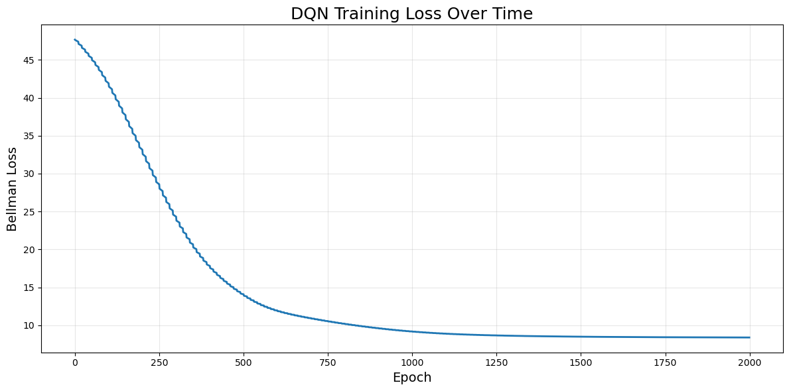
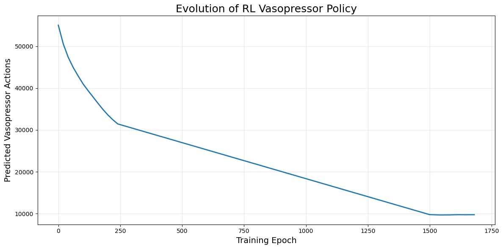
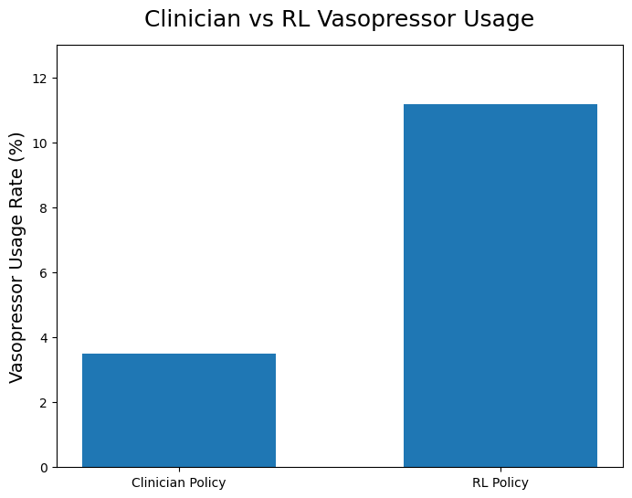
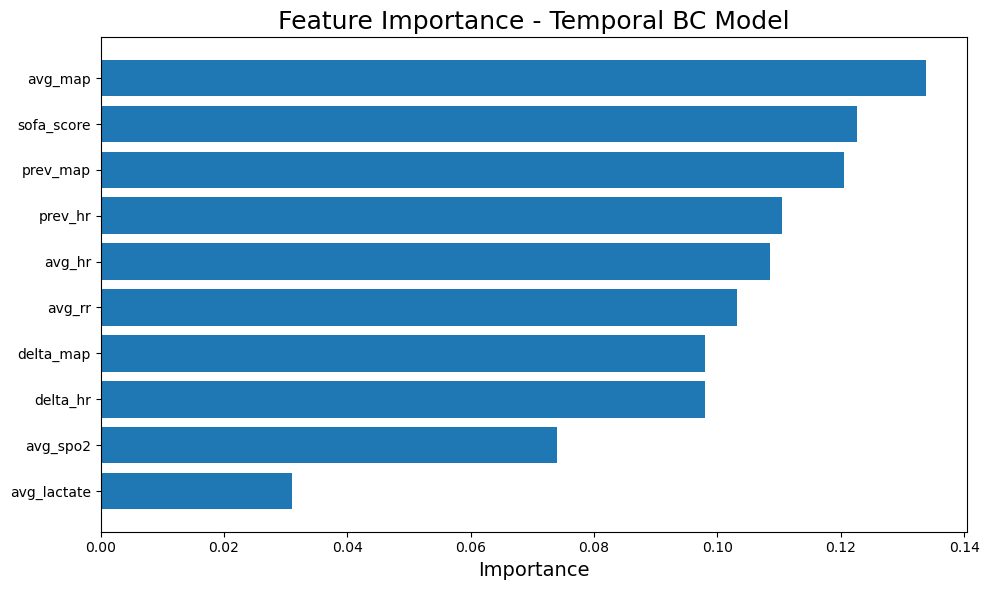

# Offline Reinforcement Learning for Sepsis Treatment Policy Optimization

## Overview

This project explores **offline reinforcement learning (RL)** for learning a
vasopressor treatment policy from retrospective ICU time-series data.

The patient state includes physiological variables such as:

- Heart rate (HR)
- Mean arterial pressure (MAP)
- Respiratory rate (RR)
- SpO₂
- Lactate
- SOFA score
- Previous HR/MAP values and temporal changes

The treatment action represents vasopressor administration, and the project
uses state-action-reward-next-state transitions to train a Deep Q-Network (DQN).

> **Disclaimer:** This project is for research and educational purposes only.
> It is not a clinically validated treatment system and must not be used for
> real-world medical decision-making.

## Project Pipeline

```text
ICU Time-Series Data
        ↓
Data Preprocessing
        ↓
Temporal Feature Engineering
        ↓
Behavior Cloning Baseline
        ↓
State / Action / Reward / Next-State Construction
        ↓
Deep Q-Network (DQN)
        ↓
Policy Learning
        ↓
Policy Evaluation & Visualization
```

## State Representation

The model uses physiological and temporal features including:

- `avg_hr`
- `avg_map`
- `avg_rr`
- `avg_spo2`
- `avg_lactate`
- `sofa_score`
- `prev_hr`
- `prev_map`
- `delta_hr`
- `delta_map`

## Action

The vasopressor treatment is represented as a discrete action:

- `0` → No vasopressor
- `1` → Vasopressor

## Reward

The reward is derived from the change in MAP between the current and next
time step.

## Model

A Deep Q-Network is used to estimate Q-values for the available treatment
actions.

```text
Input State
    ↓
128 neurons + ReLU
    ↓
128 neurons + ReLU
    ↓
Q-values
    ├── Action 0: No vasopressor
    └── Action 1: Vasopressor
```

The training setup in the notebook uses an Adam optimizer, discount factor,
Bellman loss, gradient clipping, and a target network for more stable learning.

---

## Results and Visualizations

### 1. DQN Training Loss

The Bellman loss decreases substantially during training and approaches a
relatively stable region in later epochs.



### 2. Evolution of the RL Vasopressor Policy

This plot shows how the number of predicted vasopressor actions changes over
training epochs.



### 3. Clinician vs RL Vasopressor Usage

Comparison of vasopressor usage rates between the historical clinician policy
and the learned RL policy.



### 4. Feature Importance

Feature importance from the temporal behavior-cloning model. In the notebook,
MAP, SOFA score, previous MAP, previous HR, and HR-related variables are among
the more influential features.



---

## Data

The raw ICU dataset is **not included in this repository**.

The processed data used by the notebook contains variables such as:

```text
stay_id
hour_bucket
avg_hr
avg_map
avg_rr
avg_spo2
avg_lactate
sofa_score
vaso_action
next_hr
next_map
reward
```

The original data was queried and processed from ICU clinical data using
BigQuery.

## Repository Structure

```text
offline-rl-sepsis-treatment-policy/
│
├── README.md
│
├── notebooks/
│   └── RL_Model.ipynb
│
├── data/
│   └── README.md
│
├── models/
│   └── dqn_sepsis_policy.pth
│
├── results/
│   ├── dqn_loss_curve.png
│   ├── policy_evolution.png
│   ├── clinician_vs_rl.png
│   └── feature_importance.png
│
└── requirements.txt
```

## Technologies

- Python
- Pandas
- NumPy
- Scikit-learn
- PyTorch
- Matplotlib
- Jupyter Notebook
- Google BigQuery

## Future Improvements

- More robust offline RL algorithms such as CQL or IQL
- Better off-policy evaluation
- Patient-level train/validation/test splitting
- Additional physiological features
- More clinically meaningful reward design
- Comparison with additional treatment-policy baselines

## Disclaimer

This repository presents a research/educational experiment in offline
reinforcement learning using retrospective ICU data. The learned policy has
not been clinically validated.
